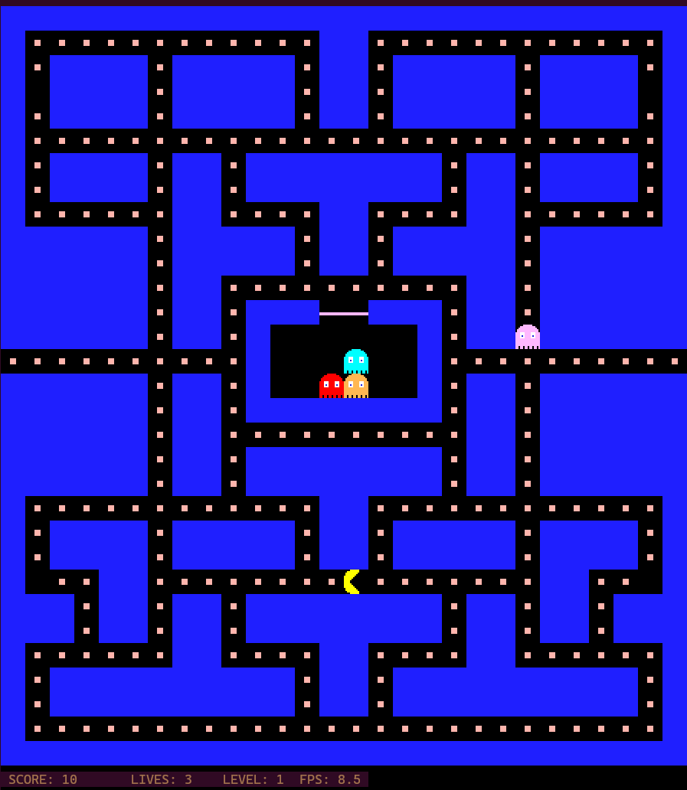

# PAC-MAN - Terminal Edition

Not So Vibe Coding Journey of Pacman

A recreation of the classic 1980s Pac-Man arcade game for the terminal, with authentic retro graphics using colored block characters.



## Features

- **Authentic 1980s arcade graphics** using colored █ blocks
- **Original maze layout** (28x31 tiles)
- **Animated Pac-Man** with 3-frame mouth animation
- **4 Ghosts with AI:**
  - Blinky (Red) - Aggressive chaser
  - Pinky (Pink) - Ambusher
  - Inky (Cyan) - Flanker
  - Clyde (Orange) - Unpredictable
- **Power Pellets** - Turn ghosts blue and eat them!
- **Scoring system** - 10 points per pellet, 50 for power pellets, 200 per ghost
- **3 Lives system**
- **Works over SSH** - Play remotely!

## Requirements

- Go 1.16 or later
- Terminal with 256-color support
- Linux/Unix environment

## How to Run

### Locally:
```bash
./pacman
```

### Over SSH:
```bash
ssh user@your-server
./pacman
```

## Controls

- **Arrow Keys** - Move Pac-Man (Up/Down/Left/Right)
- **ESC or Q** - Quit game

## Game Rules

1. Eat all the pellets (·) to win the level
2. Avoid the ghosts or you'll lose a life
3. Eat power pellets (●) to turn ghosts blue temporarily
4. While ghosts are blue, you can eat them for bonus points!
5. Game over when you run out of lives

## Graphics

The game uses Unicode block characters (█) with 256-color ANSI codes to recreate the pixel-art look of the original 1980s arcade game:

- **Blue walls** - Original maze pattern
- **Yellow Pac-Man** - Animated mouth opening/closing
- **Colored ghosts** - Red, Pink, Cyan, Orange
- **Pellets & Power Pellets** - Small dots and large circles

## Building from Source

```bash
go build -o pacman
```

## Troubleshooting

**"Error creating game: open /dev/tty"**
- Make sure you're running in an actual terminal, not as a background process
- The game requires a TTY to display graphics

**Colors not showing correctly**
- Ensure your terminal supports 256 colors
- Try: `export TERM=xterm-256color`

**Game runs slow over SSH**
- This is normal for some networks
- Try a faster connection or local network

## Technical Details

- Built with Go using the `tcell` library for terminal control
- Each game tile is rendered as 1 character
- Sprites are 3x2 characters for retro pixel-art look
- Runs at ~60 FPS game tick rate
- Fully compatible with SSH connections

Enjoy the game!
